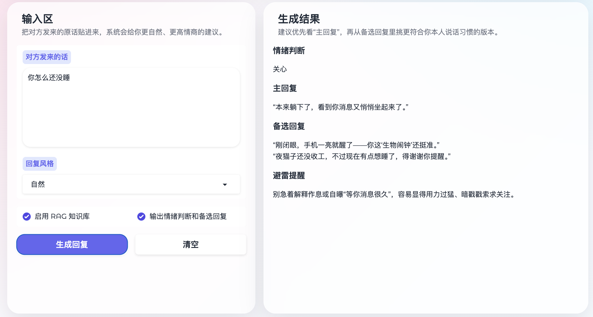
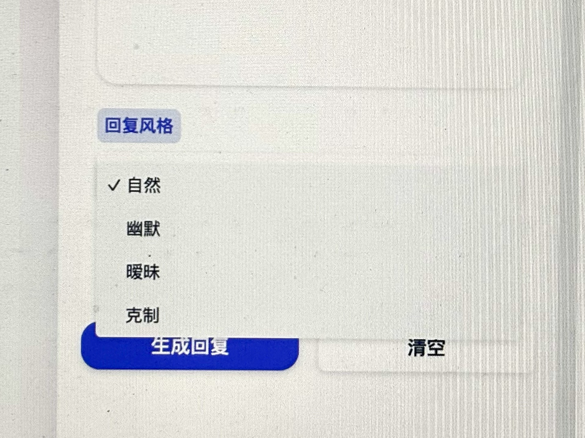

# AI Conversation Coach 💬✨

一个基于 **LLM + RAG + Prompt Engineering** 的高情商聊天助手，帮助用户把“不擅长回女生消息的直男”变成“芳心纵火犯”。


---

## 🚀 项目简介

AI Conversation Coach 是一个面向真实聊天场景的 AI 应用，核心能力包括：

- 根据对方消息生成自然、高情商回复
- 支持多种风格（自然 / 幽默 / 暧昧 / 克制）
- 基于 RAG 引入聊天策略知识库，提升回复质量
- 支持 Streaming 实时生成，提升交互体验
- 提供评测流程，用于分析 RAG 检索效果

---
## 项目展示（Demo）

下面展示 AI Conversation Coach 的核心功能与效果：

---

### 🖥️ 整体界面


基于 Gradio 构建的交互界面，用户可以输入聊天内容，选择回复风格，并实时生成高情商回复。

---

### 💬 回复生成效果



系统会对输入内容进行情绪判断，并生成自然、不油腻的高情商回复，同时提供多条备选表达，提升实际聊天可用性。

---

### 🎭 多风格回复



通过 Prompt Engineering 支持多种回复风格（自然 / 幽默 / 暧昧 / 克制），适配不同聊天场景需求。

---

### 📚 RAG 知识增强


通过 RAG（检索增强生成）从知识库中检索相关内容并注入上下文，有效减少模型幻觉，提高回复的相关性与稳定性。

---

## 🧠 技术架构
```
User Input
   ↓
Embedding（语义向量化）
   ↓
RAG Retrieval（相似度检索 Top-K 场景策略）
   ↓
Prompt Engineering（上下文注入）
   ↓
LLM Generation（Qwen API）
   ↓
Streaming Output（逐 token 输出）
```

---

## 📦 项目结构
```
aliyun_acp_py_stage1/
├── app/
│   ├── llm/              # LLM 调用与 Prompt 模板
│   ├── rag/              # RAG 索引与问答服务
│   ├── evaluation/       # RAG 评测模块
│   └── utils/            # 工具函数
├── data/
│   ├── docs/             # 聊天策略知识库（RAG）
│   └── eval/             # 评测数据集
├── scripts/
│   ├── build_index.py    # 构建向量索引
│   ├── chat_cli.py       # 命令行对话
│   └── evaluate_rag.py   # RAG评测
├── requirements.txt
└── main.py
```
---

## ⚙️ 安装

cd aliyun_acp_py_stage1
python -m venv .venv
source .venv/bin/activate
pip install -U pip
pip install -r requirements.txt
cp config/settings.example.env .env

在 `.env` 中填写：

DASHSCOPE_API_KEY=你的key
DASHSCOPE_BASE_URL=https://dashscope.aliyuncs.com/compatible-mode/v1
CHAT_MODEL=qwen-plus
EMBED_MODEL=text-embedding-v3
RAG_PERSIST_DIR=./storage/dating_reply
DOCS_DIR=./data/docs
TOP_K=4

---

## 🧩 1. 构建 RAG 知识库

python -m scripts.build_index \
  --docs-dir ./data/docs \
  --persist-dir ./storage/dating_reply

---

## 💬 2. 命令行对话（高情商回复）

python -m scripts.chat_cli --mode dating_reply

输入一句对方发来的话，例如：

你是不是对所有女生都这么好

系统会生成更自然、更高情商的回复。

---

## 📊 3. RAG 评测

在 data/eval/eval_samples.jsonl 中准备数据：

{"query":"你是不是对所有女生都这么好","ground_truth":"轻微试探，适合用轻松方式回应"}

运行评测：

python -m scripts.evaluate_rag \
  --eval-file ./data/eval/eval_samples.jsonl \
  --persist-dir ./storage/dating_reply

评测指标包括：

- context recall（检索覆盖率）
- context precision（检索相关性）
- answer correctness（生成一致性）

---

## ✨ 核心功能

1. 高情商回复生成  
   - 自然、不油腻、适合真实聊天场景  
   - 避免“查户口式提问”和过度表达  

2. 多风格输出  
   - 自然 / 幽默 / 暧昧 / 克制  
   - 支持主回复 + 备选回复  

3. RAG 知识增强  
   - 基于聊天策略文档构建向量知识库  
   - 动态检索相关场景（试探 / 情绪 / 暧昧等）  

4. Streaming 实时输出  
   - token 级流式生成  
   - 提升用户交互体验  

5. RAG 评测流程  
   - 离线评估检索效果  
   - 指导知识库优化  

---

## 🎯 项目亮点

- 完整实现 LLM + RAG + Streaming + Evaluation 工程闭环  
- 将聊天策略结构化为可检索知识库  
- 支持多风格与结构化输出控制（Prompt Engineering）  
- 具备真实 AI 产品形态（而非简单 demo）  

---


## 📌 后续优化方向

- 多轮对话（Conversation Memory）  
- Agent 化策略选择  
- 更细粒度情绪识别  
- 更大规模聊天语料库  
